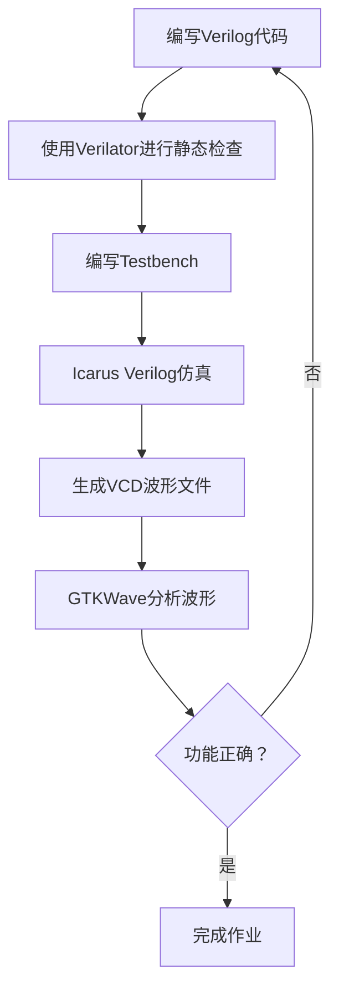
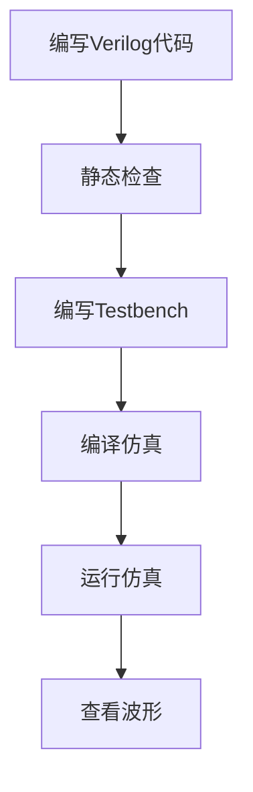
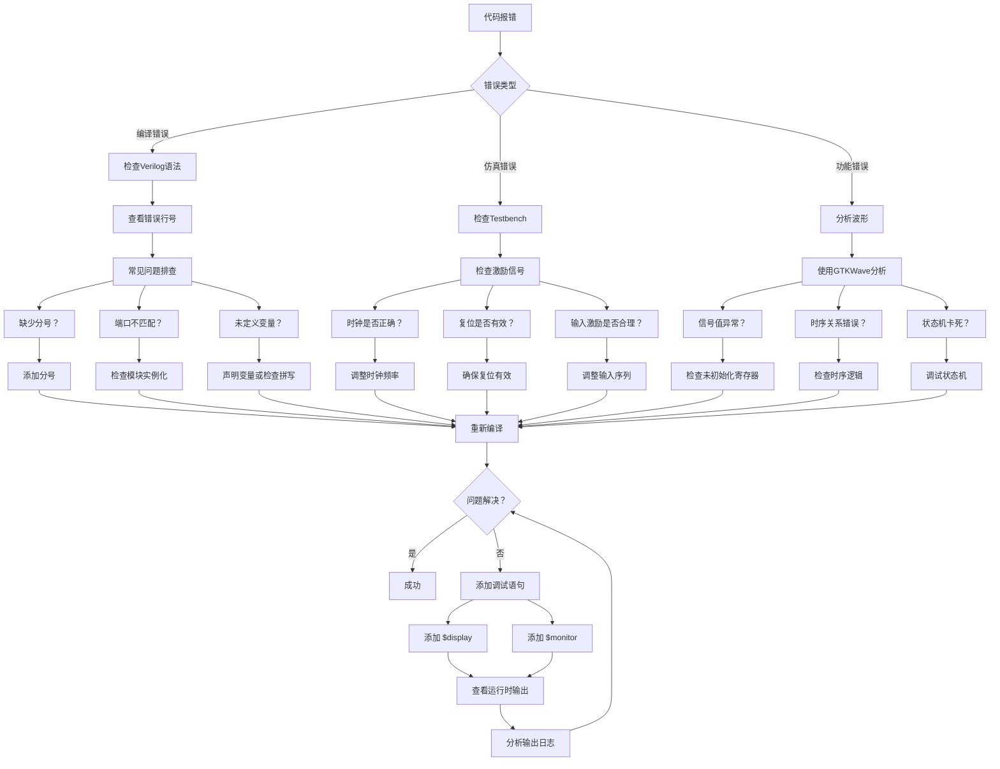

[TOC]
***
- 安装的开源工具链（Icarus Verilog + Verilator + GTKWave）实现这三个设计.

# 三个设计的开源实现可行性

| 设计类型       | 开源工具支持 | 所需组件                     | 硬件依赖         |
|----------------|--------------|------------------------------|------------------|
| **FIFO设计**   | ✅ 完美支持   | Icarus/Verilator + GTKWave    | 纯仿真无需硬件   |
| **DDS设计**    | ✅ 完美支持   | Icarus/Verilator + GTKWave    | 纯仿真无需硬件   |
| **串口通信**   | ✅ 完美支持   | Icarus/Verilator + GTKWave    | 纯仿真无需硬件   |

> 所有设计都可以**仅通过仿真完成**，不需要实际FPGA板。如果选择串口通信并想实际测试，才需要FPGA板。

### 具体实现方案

#### 1. FIFO设计 (推荐)
最简单的选择，纯数字逻辑，无外部接口
```verilog
// fifo.v - 异步FIFO核心代码
module fifo #(
    parameter DATA_WIDTH = 8,
    parameter ADDR_WIDTH = 4  // 深度=2^4=16
)(
    input  wire wr_clk,
    input  wire wr_rst,
    input  wire wr_en,
    input  wire [DATA_WIDTH-1:0] din,
    
    input  wire rd_clk,
    input  wire rd_rst,
    input  wire rd_en,
    output wire [DATA_WIDTH-1:0] dout,
    
    output wire full,
    output wire empty
);
    // 指针使用格雷码
    reg [ADDR_WIDTH:0] wr_ptr_gray, rd_ptr_gray;
    
    // 双端口RAM
    reg [DATA_WIDTH-1:0] mem [(1<<ADDR_WIDTH)-1:0];
    
    // 写逻辑
    always @(posedge wr_clk) begin
        if (wr_rst) wr_ptr_gray <= 0;
        else if (wr_en && !full) begin
            mem[wr_ptr_gray[ADDR_WIDTH-1:0]] <= din;
            wr_ptr_gray <= next_gray(wr_ptr_gray);
        end
    end
    
    // 读逻辑
    always @(posedge rd_clk) begin
        if (rd_rst) rd_ptr_gray <= 0;
        else if (rd_en && !empty) begin
            dout <= mem[rd_ptr_gray[ADDR_WIDTH-1:0]];
            rd_ptr_gray <= next_gray(rd_ptr_gray);
        end
    end
    
    // 空满判断
    assign full = (wr_ptr_gray == {~rd_ptr_gray[ADDR_WIDTH:ADDR_WIDTH-1], rd_ptr_gray[ADDR_WIDTH-2:0]});
    assign empty = (wr_ptr_gray == rd_ptr_gray);
    
    // 格雷码计数器
    function [ADDR_WIDTH:0] next_gray;
        input [ADDR_WIDTH:0] gray;
        reg [ADDR_WIDTH:0] bin;
        begin
            bin = gray ^ (gray >> 1);  // 格雷码转二进制
            bin = bin + 1;              // 二进制加1
            next_gray = bin ^ (bin >> 1); // 转回格雷码
        end
    endfunction
endmodule
```

**测试流程**：
1. 编写Testbench测试边界情况（满/空/同时读写）
2. 使用Icarus仿真：
   ```bash
   iverilog -o fifo_test fifo.v tb_fifo.v
   vvp fifo_test
   gtkwave wave.vcd
   ```

#### 2. DDS设计 (直接数字频率合成)
```verilog
// dds.v
module dds #(
    parameter PHASE_WIDTH = 24,
    parameter ROM_WIDTH = 8
)(
    input clk,
    input rst,
    input [PHASE_WIDTH-1:0] freq_word,  // 频率控制字
    output reg [ROM_WIDTH-1:0] sine_out
);
    // 相位累加器
    reg [PHASE_WIDTH-1:0] phase_accum;
    
    // 正弦波ROM表
    reg [ROM_WIDTH-1:0] sine_rom [0:255];
    initial $readmemh("sine_table.hex", sine_rom);
    
    always @(posedge clk) begin
        if (rst) begin
            phase_accum <= 0;
            sine_out <= 0;
        end else begin
            phase_accum <= phase_accum + freq_word;
            sine_out <= sine_rom[phase_accum[PHASE_WIDTH-1:PHASE_WIDTH-8]];
        end
    end
endmodule
```

**创建正弦波表** (`sine_table.hex`):
```python
# gen_sine_table.py
import math
with open('sine_table.hex', 'w') as f:
    for i in range(256):
        value = int(127.5 + 127.5 * math.sin(2 * math.pi * i / 256))
        f.write(f"{value:02X}\n")
```

#### 3. 串口通信设计 (UART)
```verilog
// uart_tx.v
module uart_tx #(
    parameter CLK_FREQ = 12_000_000,
    parameter BAUD_RATE = 115200
) (
    input clk,
    input rst,
    input tx_start,
    input [7:0] tx_data,
    output reg tx_done,
    output reg tx_pin
);
    localparam BIT_PERIOD = CLK_FREQ / BAUD_RATE;
    localparam IDLE = 0, START = 1, DATA = 2, STOP = 3;
    
    reg [2:0] state;
    reg [2:0] bit_index;
    reg [15:0] clk_counter;
    reg [7:0] data_reg;
    
    always @(posedge clk) begin
        if (rst) begin
            state <= IDLE;
            tx_pin <= 1'b1;
            tx_done <= 1'b0;
        end else begin
            case(state)
                IDLE: begin
                    tx_pin <= 1'b1;
                    if (tx_start) begin
                        state <= START;
                        data_reg <= tx_data;
                        clk_counter <= 0;
                        bit_index <= 0;
                    end
                end
                
                START: begin
                    tx_pin <= 1'b0;  // 起始位
                    if (clk_counter == BIT_PERIOD-1) begin
                        state <= DATA;
                        clk_counter <= 0;
                    end else begin
      clk_counter <= clk_counter + 1;
                    end
                end
                
                DATA: begin
                    tx_pin <= data_reg[bit_index];
                    if (clk_counter == BIT_PERIOD-1) begin
                        clk_counter <= 0;
                        if (bit_index == 7) begin
                            state <= STOP;
                        end else begin
                            bit_index <= bit_index + 1;
                        end
                    end else begin
                        clk_counter <= clk_counter + 1;
                    end
                end              
                STOP: begin
                    tx_pin <= 1'b1;  // 停止位
                    if (clk_counter == BIT_PERIOD-1) begin
                        state <= IDLE;
                        tx_done <= 1'b1;
                    end else begin
                        clk_counter <= clk_counter + 1;
                    end
                end
            endcase
        end
    end
endmodule
```
- 开源工具链可以完成从仿真到烧录FPGA的全流程，但取决于你的FPGA板型号：

| 工具 | 功能 | 支持的FPGA板 |
|------|------|-------------|
| Icarus Verilog | Verilog仿真 | 所有（仅仿真） |
| Verilator | 高性能仿真/Linting | 所有（仅仿真） |
| GTKWave | 查看仿真波形 | 所有 |
| **Yosys** | 逻辑综合 | Lattice iCE40, ECP5; 部分Xilinx |
| **nextpnr** | 布局布线 | Lattice iCE40, ECP5 |
| **OpenOCD** | FPGA烧录 | 多数开发板 |


### 开源工具链完整工作流程



### VSCode配置建议 (`settings.json`)
```json
{
    "digital-ide.function.lsp.linter.vlog.diagnostor": "verilator",
    "digital-ide.function.verilog.toolPath.iverilog": "/usr/bin/iverilog",
    "digital-ide.function.verilog.toolPath.verilator": "/usr/bin/verilator",
    
    // 添加自定义任务
    "tasks": [
        {
            "label": "Run Verilator Lint",
            "type": "shell",
            "command": "verilator --lint-only -Wall ${file}"
        },
        {
            "label": "Run Simulation",
            "type": "shell",
            "command": "iverilog -o ${fileDirname}/sim.out ${file} && vvp ${fileDirname}/sim.out"
        },
        {
            "label": "View Waveform",
            "type": "shell",
            "command": "gtkwave ${fileDirname}/wave.vcd"
        }
    ]
}
```
### 选择建议

1. **FIFO设计**：
   - 👍 最适合纯仿真验证
   - ⏱ 实现和测试时间最短
   - 📚 涵盖重要概念：时钟域、状态机、存储器

2. **DDS设计**：
   - 🌊 可生成漂亮的正弦波
   - 🔢 涉及数学概念（相位累加）
   - 🎛 可通过参数调整频率

3. **串口通信**：
   - 🔌 最接近实际应用
   - 📡 可扩展到与PC通信
   - ⚠️ 需要精确的时序控制

**推荐选择FIFO设计**，因为：
- 是数字设计的基础组件
- 测试用例清晰（满/空/半满状态）
- 不需要外部设备或复杂验证
- 老师通常最熟悉这个设计的评判标准

###  推荐学习路径
1. **纯仿真阶段**：用Icarus/Verilator完成组合逻辑、时序逻辑练习
   - 7段数码管显示
   - 状态机设计（交通灯控制）
   - FIFO设计

2. **入门FPGA**：购买$30左右的iCE40开发板
   - LED流水灯
   - 按键消抖
   - PWM调光

3. **进阶项目**：
   ```mermaid
   graph LR
   A[基础外设] --> B[VGA显示]
   A --> C[音频合成]
   A --> D[软核处理器]
   B --> E[游戏机]
   C --> F[数字合成器]
   D --> G[RISC-V SoC]
***
## 使用开源工具链编译、调试与问题排查指南

## 命令行编译流程

### 通用编译流程（所有设计）



### 具体命令（以FIFO为例）

```bash
# 1. 静态检查（Verilator）
verilator --lint-only -Wall fifo.v

# 2. 编译仿真（Icarus Verilog）
iverilog -o fifo_sim fifo.v tb_fifo.v

# 3. 运行仿真（生成波形）
vvp fifo_sim -lxt2

# 4. 查看波形
gtkwave wave.vcd
```

### 各设计编译示例

#### FIFO设计
```bash
iverilog -o fifo_sim fifo.v tb_fifo.v
vvp fifo_sim
gtkwave fifo_wave.vcd
```

#### DDS设计
```bash
# 首先生成正弦波表
python gen_sine_table.py

# 然后编译仿真
iverilog -o dds_sim dds.v tb_dds.v
vvp dds_sim
gtkwave dds_wave.vcd
```

#### 串口设计
```bash
iverilog -o uart_sim uart_tx.v uart_rx.v tb_uart.v
vvp uart_sim
gtkwave uart_wave.vcd
```
## 错误排查流程图


### 2. 仿真错误

```bash
# 示例错误：
VCD Warning: $dumpvar ignored because previous $dumpfile was not called.
```

**解决方法：**
```verilog
// 在Testbench中添加波形记录
initial begin
    $dumpfile("wave.vcd");
    $dumpvars(0, tb_module); // tb_module是你的测试模块名
end
```

### 3. 功能错误（波形不正确）

**调试技巧：**
```verilog
// 1. 添加调试输出
always @(posedge clk) begin
    $display("Time=%0t, wr_ptr=%h, rd_ptr=%h, full=%b, empty=%b", 
             $time, wr_ptr, rd_ptr, full, empty);
end

// 2. 使用断言
always @(posedge clk) begin
    if (full && wr_en) begin
        $error("Write attempted when FIFO is full!");
        $finish;
    end
end

// 3. 关键信号监控
initial begin
    $monitor("Time=%0t: data_in=%h, data_out=%h", $time, data_in, data_out);
end
```

## 自动化脚本示例

### run_fifo.sh
```bash
#!/bin/bash

# FIFO自动化测试脚本
echo "Starting FIFO test..."

# 清理旧文件
rm -f sim.out wave.vcd

# 静态检查
echo "Running Verilator linting..."
verilator --lint-only -Wall fifo.v

# 编译
echo "Compiling with Icarus Verilog..."
iverilog -o sim.out fifo.v tb_fifo.v

# 仿真
echo "Running simulation..."
vvp sim.out -lxt2

# 查看波形
echo "Opening waveform..."
gtkwave wave.vcd fifo.gtkw &
```

### 使用说明
```bash
# 1. 创建脚本
nano run_fifo.sh

# 2. 粘贴上述内容
# 3. 添加执行权限
chmod +x run_fifo.sh

# 4. 运行
./run_fifo.sh
```

## 高级调试技巧

### 1. 分模块调试
```bash
# 只编译特定模块
iverilog -o module_test -DDEBUG_MODULE module.v tb_module.v
```

### 2. 条件编译
```verilog
`ifdef DEBUG
    $display("Debug info: value = %h", signal);
`endif
```

### 3. 波形比较
```bash
# 生成参考波形
vvp golden_sim

# 生成测试波形
vvp test_sim

# 比较波形
vcddiff golden_wave.vcd test_wave.vcd
```

### 4. 性能分析
```bash
# 使用Valgrind进行性能分析
iverilog -o sim.out design.v tb_design.v
valgrind --tool=callgrind vvp sim.out
kcachegrind callgrind.out.*
```
## 常用调试命令参考

| 命令 | 功能 | 示例 |
|------|------|------|
| `$display` | 打印信息 | `$display("Value = %d", data);` |
| `$monitor` | 监控变量变化 | `$monitor("Time=%t clk=%b", $time, clk);` |
| `$dumpfile` | 指定波形文件 | `$dumpfile("wave.vcd");` |
| `$dumpvars` | 指定记录变量 | `$dumpvars(0, tb_module);` |
| `$random` | 生成随机数 | `data = $random % 256;` |
| `$finish` | 结束仿真 | `$finish;` |
| `$stop` | 暂停仿真 | `$stop;` |

## 环境配置建议

### .bashrc 别名设置
```bash
# 添加以下内容到 ~/.bashrc
alias vsim='vvp -n'
alias vwave='gtkwave wave.vcd'
alias vlint='verilator --lint-only -Wall'
alias vcomp='iverilog -o sim.out'

# 使用示例：
# vlint design.v
# vcomp design.v tb.v
# vsim sim.out
# vwave
```


- 使用开源工具链完全足够，你已安装的Icarus Verilog + Verilator + GTKWave组合可以完美完成仿真、波形查看和功能验证。如果需要实际硬件测试，再考虑购买iCE40开发板
- 通过这些工具和技巧，你可以高效地编译、调试和验证你的设计。遇到问题时，按照流程图逐步排查，结合调试输出和波形分析，大多数问题都能快速定位并解决。